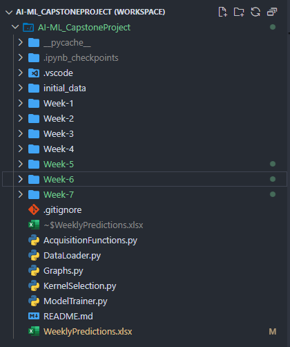

### Repository structure

####    How have you organised your repository so far (e.g. data, notebooks, queries, results)?

*   My optimisation approach is organised somewhat similar to a "framework". I have designed it in such a way that most of the code is contained within reusable Python modules & functions, requiring very little coding work on a week-by-week basis. The code that is specific to a given week, is contained within a directory that is named after the week (Week-2, Week-3, Week-4 etc.). This directory contains 1 **Jupyter** notebook and couple of **Python** files (for graphical representation) for each of the 8 black-box functions. The weekly directory also contains the input data-points and the output values for all 8 functions up until that week. The reusable Python modules & functions, however, are stored in the parent directory of the weekly ones. The following screenshot provides a glimpse of how the project files are organized. 
    
    

####    What changes will you make to improve clarity, navigability and reproducibility?

*   As hinted in the screenshot, the source code (Python files) are already quite navigable since weekly changes are clearly segregated in respective directories. Importing the GitHub repository in a modern IDE (PyCharm, VS Code etc.) should offer even more easier navigation through class/function/module hyperlinks. The weekly Python scripts can be minimized further by use of object-oriented design principles (reusable functions moved into classes, methods declared in super-classes being overridden in sub-classes etc.). An object-oriented design should also make the project codebase more extensible and maintainable.

### Coding libraries and packages

####    Which libraries or frameworks (e.g. PyTorch, TensorFlow, scikit-learn) are central to your approach?

*   My approach is based on the **scikit-learn** library and primarily on the `sklearn.gaussian_process` & `sklearn.gaussian_process.kernels` packages. The scikit-learn library contains classes like <code>GaussianProcessRegressor</code> and various kernel implementations such as <code>RBF</code>, <code>Matern</code>, <code>RationalQuadratic</code> etc.

####    Why are these choices appropriate for your problem, and what trade-offs did you consider?

*   **scikit-learn** has been my default library/framework of choice because examples & exercises on **Bayesian Optimmization** are built on this library in this course. For Bayesian Optimization exercises and learning, scikit-learn is usually preferred because it provides:
    -   Faster training
    -   Simpler API
    -   More deterministic objectives
    -   Smaller hyperparameter spaces
    -   Less boilerplate code
*   I also did consider **PyTorch** and **TensorFlow**, however, I found them to be more complicated than **scikit-learn** for these set of black-box functions.
PyTorch and TensorFlow require custom training loops, involve larger hyperparameter spaces, and introduce stochasticity from random initialization and SGD, which make them more appropriate for deep learning and hyperparameter tuning. However, from additional studies beyond this course, I have come to know about other frameworks like <b>GPyTorch</b> that may offer alternative ways of building GP models and provide some of the most advanced algorithms in the field.
For future projects related to Bayesian Optimization, I would like to explore GPyTorch and put it to good use.

### Documentation

####    How do your README and other documents currently describe the purpose, inputs, outputs and objectives of your BBO capstone project?

*   The [readme file](../README.md) provides a synopsis of the project to anyone interested in learning <b>Bayesian Optimization</b> through this example codebase. It contains the following sections -
    -   Project overview
    -   Overall goals
    -   Relevance to real-life AI-ML use cases
    -   Relevance to career paths in AI-ML
    -   Description of the input & output data formats
    -   Summary of the technical implementation
*   Another, very useful document is [weekly computations](../WeeklyPredictions.xlsx), which serves as a single place tracker of the progress made from the very beginning up to the latest week. It contains the following information -
    -   For each function
        -   All query points (starting from the initial sets and then on weekly basis)
        -   Output value against each query point
        -   GP regressor (<code>GaussianProcessRegressor</code>) hyper-parameters
        -   Kernel hyper-parameters
*   The main GP model computations (training & prediction) happen inside **Jupyter** notebooks that are segregated by week and function. However, for every week and every function there are 2 ancillary **Python** source files; they provide useful insight on the overall progress.
    -   Week-<idx>_Function-<idx>_viz.py: Plots cumulative output values against each input feature for a given function on a scatter chart and draw the corresponding GP regressor prediction (mean as well as std. deviation) on the same chart. This technique presents a visual comparison between the predicted nature of the unknown function by the GP model and the actual evaluation of the function at selected query points.
    -   Week-<idx>_Function-<idx>_FeatureImp.py: Shows the relative importance of the input features of each function using horizontal bar diagram. This information is very helpful, especially for higher-dimensioanl functions (such as function 6, 7 & 8) as it hints which features influence the function output the most and therefore crucial to reach the global optimum.

####    What updates do you need to align the documentation with your most recent strategy and results?

*   Every week, the [README.md](../README.md) & [WeeklyPredictions.xlsx](../WeeklyPredictions.xlsx) need to be updated with the computational hyper-parameters of the GP model (such as noise estimate, length scale, smoothness, kernel type), output value of the previous week, recomputed prediction of the unknown function after inclusion of the latest output (actual) value, exploration/exploitation trade-off for the week, evaluation of the acquisition function and finally, the input data-point to be queried next week. Over a period of several weeks, this iterative process should lead us to the globally optimum (maximum) data-point & output value for all of the 8 unknown functions.
